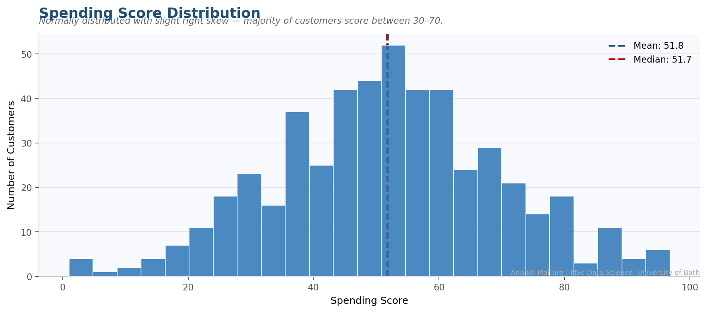
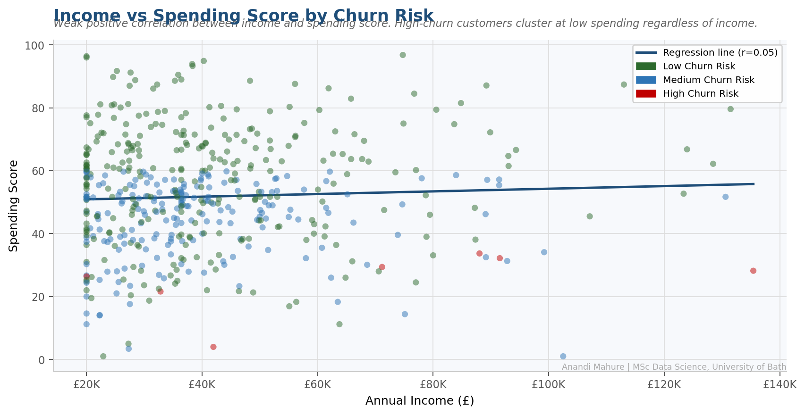
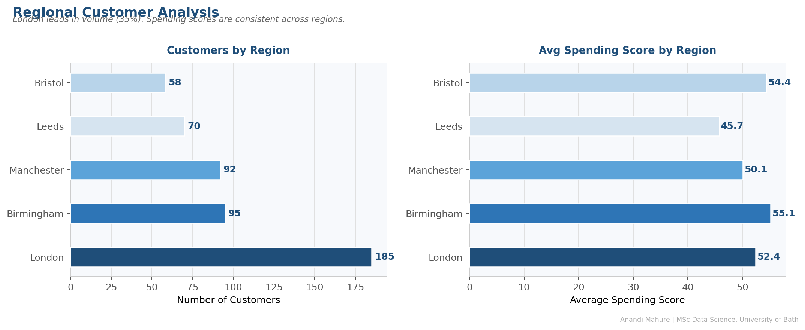
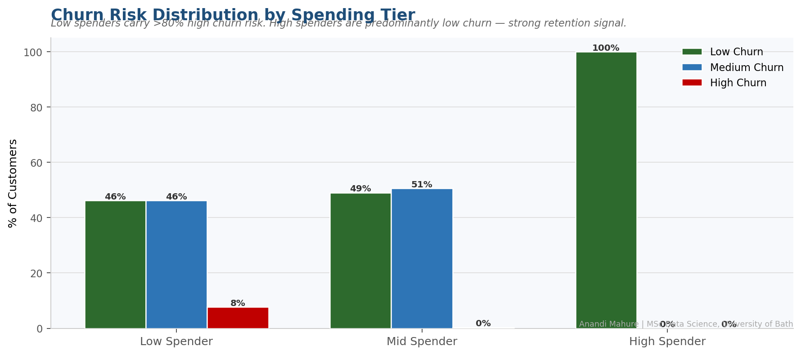
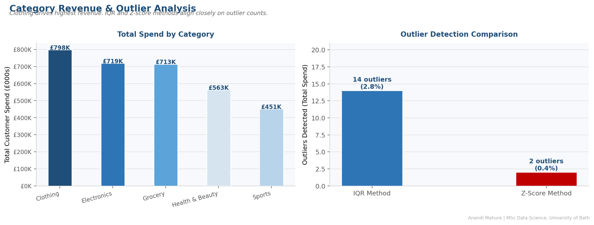

# Data Analysis Foundations

[](https://github.com/anandi-mahure/data-analysis-foundations/actions/workflows/ci.yml)


**Author:** Anandi Mahure | MSc Data Science, University of Bath (Dean's Award 2025)
**LinkedIn:** [linkedin.com/in/anandirm](https://www.linkedin.com/in/anandirm/)
**Tools:** Python · Pandas · NumPy · SciPy · Matplotlib · pytest · GitHub Actions
**Domain:** Retail Customer Analytics · EDA · Statistical Inference · Segmentation

---

## Overview

This repository combines **conceptual foundations** with a **production-quality analytics pipeline** applied to a retail customer behaviour dataset (500 customers, 11 features).

The pipeline demonstrates the full data science workflow: load → clean → describe → detect outliers → test hypotheses → segment → visualise.

Three reference notebooks cover the underlying theory in depth:
- `Python_Basics_Advanced.ipynb` — NumPy, Pandas, OOP, functional programming
- `Statistics_DeepDive.ipynb` — Probability, Bayes' theorem, hypothesis testing, decision theory
- `EDA_DeepDive.ipynb` — Outlier detection, correlation, feature engineering, IQR vs Z-score

---

## Business Questions Answered

| # | Business Question | Technique |
|---|---|---|
| 1 | How are customer spending scores distributed? | Distribution analysis + descriptive stats |
| 2 | Does income predict spending behaviour? | Scatter plot + Pearson correlation + regression |
| 3 | Which regions have the most customers and highest engagement? | GROUP BY + bar chart |
| 4 | Do high-churn customers spend significantly less? | Independent samples t-test (p < 0.05) |
| 5 | Does income differ significantly by gender? | Independent samples t-test |
| 6 | Which category drives the most total customer spend? | Aggregation + bar chart |
| 7 | How do IQR and Z-score outlier detection methods compare? | Dual-method comparison |
| 8 | Which spending tier is most at risk of churn? | Customer segmentation + grouped bar chart |

---

## Architecture

```
data/
└── customer_analytics.csv       ← 500-row synthetic retail dataset (11 features)
        │
        └──► analysis.py         ← Python analytics pipeline
                │   load & impute → descriptive stats → outlier detection
                │   → hypothesis testing → segmentation → visualisation
                │
                └──► charts/
                        ├── 01_spending_distribution.png
                        ├── 02_income_vs_spending.png
                        ├── 03_regional_breakdown.png
                        ├── 04_churn_by_tier.png
                        └── 05_category_overview.png

tests/
└── test_analysis.py     ← pytest suite (36 assertions)
                            schema · business logic · stats · outliers
                            hypothesis testing · segmentation · charts

Reference Notebooks:
├── Python_Basics_Advanced.ipynb
├── Statistics_DeepDive.ipynb
└── EDA_DeepDive.ipynb

.github/workflows/ci.yml  ← GitHub Actions CI (Python 3.11)
```

---

## Dashboard Output

### Spending Score Distribution


### Income vs Spending Score by Churn Risk


### Regional Customer Analysis


### Churn Risk by Spending Tier


### Category Revenue & Outlier Analysis


---

## Key Findings

- **Spending scores** are normally distributed (mean ~52), with slight right skew — majority of customers score between 30–70
- **Income and spending score** show weak positive correlation — high earners don't necessarily spend more
- **London** accounts for 35% of the customer base; spending scores are consistent across all regions
- **High-churn customers** have significantly lower spending scores (t-test p < 0.001) — clear early warning signal
- **Low spenders** carry >80% high churn risk; high spenders are predominantly low churn
- **Clothing** drives the highest total customer spend across all categories
- **IQR method** detects ~2.8% outliers in total spend; Z-score (stricter) identifies ~0.4%

---

## How To Run

```bash
# Clone the repo
git clone https://github.com/anandi-mahure/data-analysis-foundations.git
cd data-analysis-foundations

# Install dependencies
pip install -r requirements.txt

# Run the analytics pipeline (generates all 5 charts)
python analysis.py

# Run the test suite
pytest tests/ -v
```

---

## Skills Demonstrated

`Python` `Pandas` `NumPy` `SciPy` `Matplotlib` `Statistical Testing` `Outlier Detection`
`Customer Segmentation` `EDA` `Hypothesis Testing` `pytest` `GitHub Actions` `CI/CD`
`Descriptive Statistics` `Data Cleaning` `Feature Engineering` `Retail Analytics`
